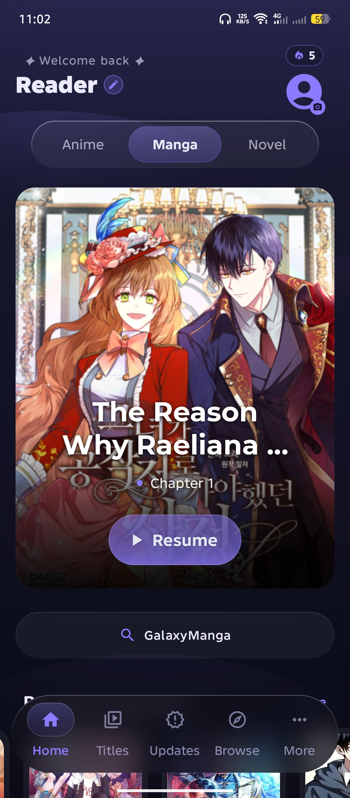
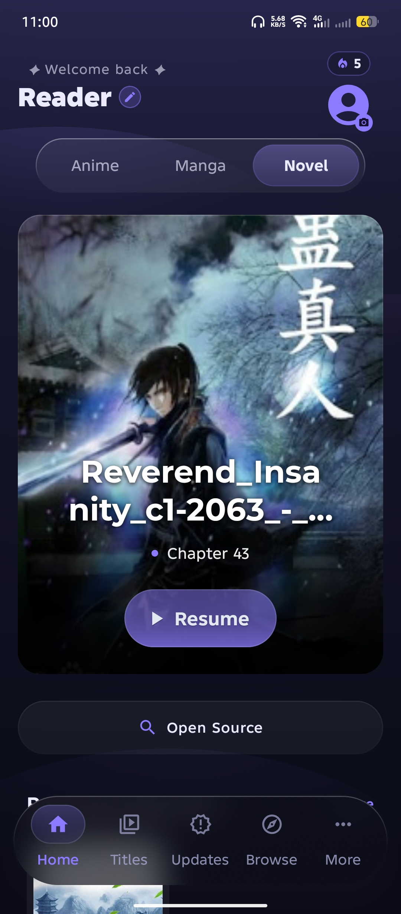
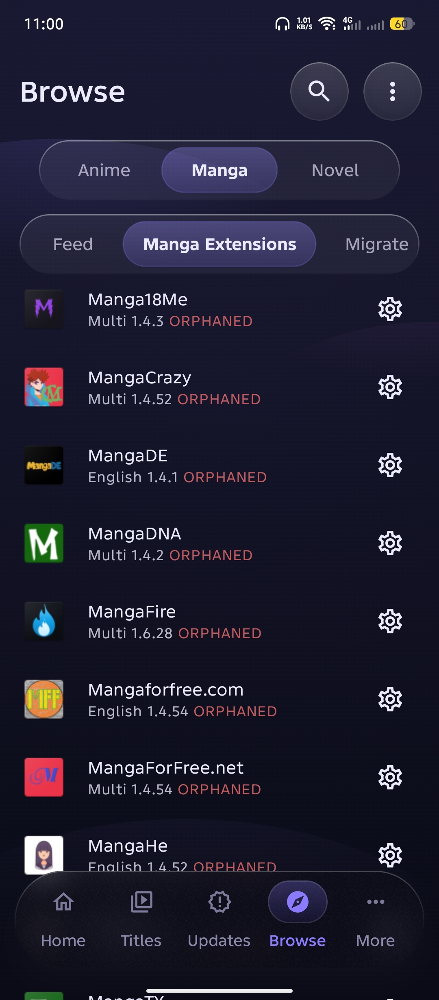
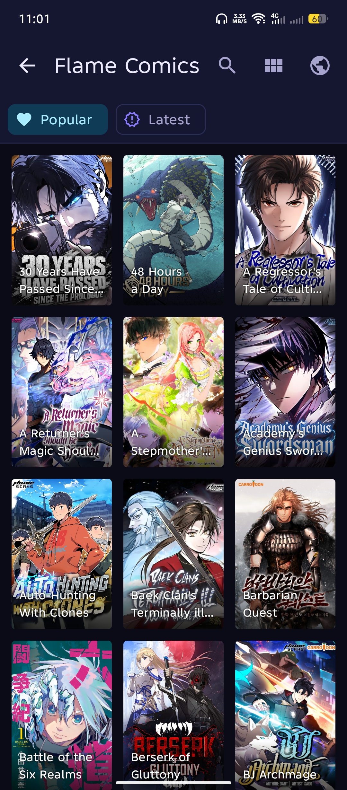
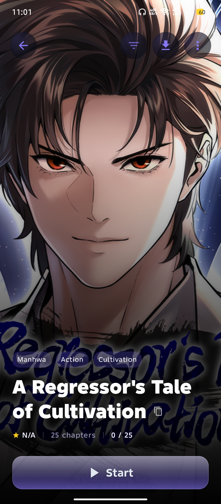

<div align="center">
  
  <h1>Yomi</h1>
  <p><strong>An open-source anime, manga, and novel reader for Android.</strong></p>
  <p>
    <a href="https://github.com/codegeasse1/yomi-reader/releases/latest"></a>
  </p>
  <p>
    <a href="LICENSE"></a>
    <a href="https://developer.android.com/about/versions/oreo"></a>
  </p>
</div>

> **⚠️ Important attribution:** Yomi is a **renamed, re-themed fork** of
> [Tadami](https://github.com/andarcanum/Tadami-Aniyomi-fork), which is itself a fork of
> [Aniyomi](https://github.com/aniyomiorg/aniyomi) built on the
> [Mihon](https://github.com/mihonapp/mihon) / Tachiyomi ecosystem. The app you see is
> Tadami's code rebranded as "Yomi" with a custom dark-glass theme — the credit for
> virtually all the engineering belongs to the upstream authors. See [Credits](#credits).

## About

Yomi is a free, open-source media reader for Android that brings anime, manga, and novels (ranobe) together in one app. It ships with a modern, Aurora-styled interface and works with the Aniyomi/Mihon/Tachiyomi extension ecosystem, so existing manga, anime, and novel source repositories can be added and used as-is.

**Yomi does not host, provide, or bundle any content, sources, or extensions.** You add your own sources and repos — Yomi is just the reader, library, and player.

## Downloads & Test Builds

Requires Android 8.0+ (API 26+). Package name: `com.yomi.reader`.

- **Test builds (`build` branch):** every commit pushed to the `build` branch is compiled automatically by GitHub Actions. Open the **Actions** tab, pick the latest **CI** run, and download the `yomi-debug-<sha>` artifact. Debug APKs are signed with the debug key and install directly (package `com.yomi.reader.localdev`).
- **Releases:** [Download the latest release](https://github.com/codegeasse1/yomi-reader/releases/latest) — signed `app-universal-release.apk` (works on any device) and `app-arm64-v8a-release.apk`, ready to install.

## Features

| Area | Details |
| --- | --- |
| Media types | Anime, manga, and novels (ranobe) in one app |
| Manga reader | Webtoon, pager, vertical, and panel viewers; data saver; downloads |
| Anime player | MPV-based video player with subtitles, downloads, and TorrServer support |
| Novel reader | WebView-based novel reader with custom backgrounds, TTS, and translation tools |
| Sources & extensions | Full Aniyomi/Mihon/Tachiyomi extension ecosystem, all three media types |
| Trackers | AniList, MyAnimeList, Kitsu, Shikimori, Trakt, Simkl, Bangumi, TMDb, Komga, Kavita, Jellyfin, Suwayomi, NovelUpdates, NovelList |
| Library | Unified library, categories, updates, history, and download queue |
| Backup & restore | Full backup/restore across all media types |
| Customization | Themes and color schemes, reader/player behavior, Aurora-style display settings |

## Screenshots

<p align="center">
  
  
  
</p>
<p align="center">
  
  
</p>

## Build From Source

Prerequisites: JDK 17, Android SDK (compile SDK 36), Android Studio (recommended).

```bash
./gradlew assembleRelease
```

On Windows:

```powershell
.\gradlew.bat assembleRelease
```

APK output: `app/build/outputs/apk/release/`

For local debug builds:

```bash
./gradlew assembleDebug
```

## Credits

Yomi is a **renamed fork** of [Tadami](https://github.com/andarcanum/Tadami-Aniyomi-fork)
(by andarcanum), which is itself a fork of [Aniyomi](https://github.com/aniyomiorg/aniyomi),
built on the [Mihon](https://github.com/mihonapp/mihon) and
[Tachiyomi](https://github.com/tachiyomiorg/tachiyomi) ecosystems.

This fork should be understood as follows:

- **Virtually all of the code** — the readers, the MPV player, the library, the extension
  ecosystem, the trackers, the backup system, and everything else — was written by the
  upstream authors above.
- **Yomi's contribution is a rebrand:** a new name, icon, splash logo, default theme
  (dark glass UI), and various strings and UI copy. It does **not** claim authorship of
  the upstream code.
- The deep-link `tadami://` scheme, backup-format identifiers, and tracker OAuth
  registrations are intentionally kept so Yomi stays compatible with the Aniyomi/Tadami
  ecosystem and with backups made in the original apps.

Upstream links:

| Project | Repository |
| --- | --- |
| Tadami (the direct base of Yomi) | https://github.com/andarcanum/Tadami-Aniyomi-fork |
| Aniyomi | https://github.com/aniyomiorg/aniyomi |
| Mihon | https://github.com/mihonapp/mihon |
| Tachiyomi | https://github.com/tachiyomiorg/tachiyomi |

If you enjoy Yomi, please consider supporting the upstream projects as well. See
[NOTICE](NOTICE) for the full attribution statement.

## Disclaimer

Yomi is a **media library manager and player**. Yomi **does not host, store, provide, bundle, or distribute** any content, sources, extensions, or repositories. The application ships **without** any preinstalled sources or repositories.

Any content accessed through Yomi comes from **third-party sources that the user chooses to add**. The Yomi project has no control over, and assumes no responsibility for, such third-party sources, their content, or their legality. Users are solely responsible for ensuring they have the right to access any content and for complying with applicable laws.

Yomi is **not affiliated with, endorsed by, or sponsored by** any anime, manga, or novel rights holder, streaming service, publisher, or studio, nor by Aniyomi, Mihon, or Tachiyomi as brands. All product names, logos, and brands are the property of their respective owners.

Yomi is intended for **lawful use only**. Do not use Yomi to infringe the rights of others.

## License

Licensed under the Apache License 2.0. See [LICENSE](LICENSE).
